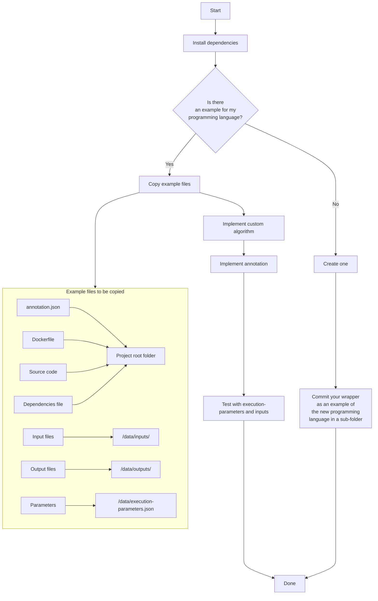
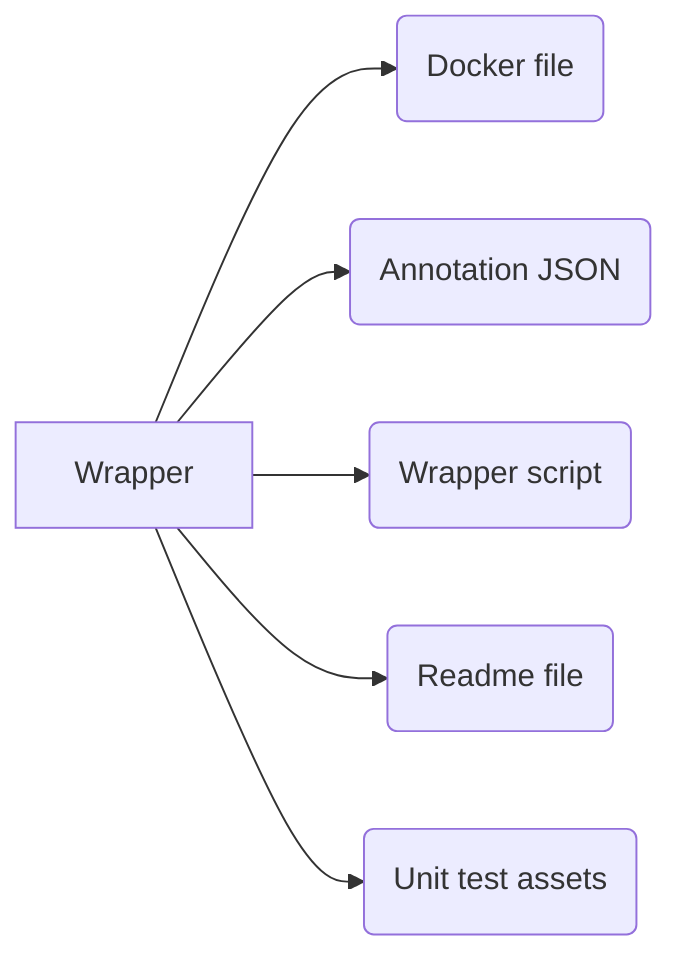

# Wrapper development kit
The aim of this project is to help contributors developing wrappers for the LifeWatch ERIC Tesseract platform.

## Usage



This project has examples for the following languages:
- Python
- Node
- C
- R (rlang)
- Octave (gnuoctave/octave, an open source alternative to MATLAB)

Choose a language and copy the contents of its folder to the root of this project.

Lets say we want to create a **Python** based wrapper:

1. Copy the contents of `./examples/python` to `./`
2. run `./bin/build-image`
3. run `./bin/execute`

## Anatomy of a Wrapper
A _Wrapper_ represents an individual operation unit that needs to be executed within the larger context of a Tesseract Workflow.\
Wrappers are small, discrete, and specific in nature, allowing for focused tasks with clear objectives.\
A _Wrapper_ is always implemented inside a [Docker container](https://www.docker.com/resources/what-container/#:~:text=A%20Docker%20container%20image%20is,tools%2C%20system%20libraries%20and%20settings).

### Interacting with the outside environment of a _Wrapper_
A _Wrapper_ can be parametrized and operated with the following three components:
1. **Inputs:** The inputs represents the data, information, or resources that are required for the _Wrapper_ to begin and be executed successfully. An input is **always a file**. It serves as the starting point for the _Wrapper_ and provides the necessary context for the _Wrapper_'s completion. Inputs come from other _Wrappers_.
2. **Outputs:** The outputs are the results or deliverables produced by the _Wrapper_ once it is completed. These are tangible **files** that are generated as a result of the _Wrapper_'s execution. Outputs represent the outcome of the _Wrapper_ and are usually the input for subsequent _Wrappers_ in the workflow. An output is **always a file**.
3. **Parameters:** Parameters are the configurable settings, options, or variables that influence the behavior and outcome of the _Wrapper_. They allow the _Wrapper_ to be adapted to different scenarios without modifying the underlying logic. Parameters are used to customize the behavior of the _Wrapper_ and may affect how it processes input data and generates outputs.

### Developing a _Wrapper_
In order to develop a wrapper the following information must be provided:

1. **Docker file:** The Dockerfile is a plain text configuration file used to define the specifications and instructions to create a _Wrapper_'s Docker container.
2. **Annotation JSON:** The Annotation JSON is a JSON file describing the ontology of the wrapper.
3. **Wrapper script:** A script that runs the actual logic (e.g. analysis of data) inside the docker image
   1. The script can be written in any language as long as there is docker environment that can run it (most used languages are Python, Node, R)
   2. A script can consist of multiple files or modules (sometimes there is too much logic to fit in a single file). Make sure to copy all additional files into the Docker image (_see Dockerfile_) and add the top-level script/module as `ENTRYPOINT`.
4. **Readme file:** The Readme file is a MARKDOWN file that serves as a user-friendly introduction and guide to the _Wrapper_.
5. **Unit test assets:** The Unit test assets allow the _Wrapper_ to be tested in isolation. 

### Wrapper annotation JSON:
Documentation of the fields present in a _Wrapper annotation JSON_ file: 
```json lines
{
  // String identifying the wrapper, must be unique in the system and written in pascal case.
  // https://betterprogramming.pub/string-case-styles-camel-pascal-snake-and-kebab-case-981407998841
  "name": "TextTranslator",
  // Label used in the UI / human-readable name of the component
  "label": "Text translator",
  // Description displayed in the UI to describe the general purpose of this wrapper
  "description": "This wrapper translates all the given documents to an user specified language",
  // Type of this wrapper, it can be one of the following [ DataAnalysing, DataCollection, DataProcessing, DataSink, DataFlow ] 
  "type": "DataCollection",
  // Name of the Docker image for this wrapper
  "dockerImage": "text-translator",
  // Lit describing all the parameters for this wrapper 
  "parameters": [
    {
      // Identifier of the variable, will be exposed in the main function inside the entrypoint Docker image => def execute(pcs: Process, db: str)
      "name": "languageCode",
      // Used in the UI, human-readable name of the parameter
      "label": "Language code",
      // Used in the UI, human-readable description for this parameter
      "description": "Language code following ISO 3166-1 alpha-2",
      // Default value for this parameter if no value is provided by the user
      "defaultValue": "en_GB",
      // Type for this parameter, it can be one of the following [ List, Boolean, Date, Double, Float, Integer, String, Timestamp ]
      "type": "String"
    }
  ],
  // List describing all the input files for this wrapper
  "inputs": [
    {
      // Type of this input file
      // Must be one of the following [ Bin, Fastq, Image, Json, Map, Rar, TempFile, Text, DataSetClass, TabularDataSet, ClassificationMetric, RDF, Zip ]
      "type": "Zip",
      // Used in the UI, human-readable name of this input
      "label": "Documents",
      // Unique identifier of this parameter
      "name": "documents",
      // Used in the UI, human-readable description for this input
      "description": "Compressed file containing all the documents to be translated"
    }
  ],
  // List describing all the output files for this wrapper
  "outputs": [
    {
      // Path were to place this output file relative to /mnt/outputs
      "path": "translatedDocuments.zip",
      // Used in the UI, human-readable name of this input
      "label": "Translated",
      // Unique identifier of this parameter
      "name": "translated-documents",
      // Used in the UI, human-readable name of this output
      "description": "Compressed file containing all the translated documents",
      // Type of this output file
      // Must be one of the following [ Bin, Fastq, Image, Json, Map, Rar, TempFile, Text, DataSetClass, TabularDataSet, ClassificationMetric, RDF, Zip ]
      "type": "Zip"
    },
    {
      "path": "language-dictionary/dictionary.txt",
      "label": "Dictionary",
      "description": "Full language dictionary of the translated language",
      "type": "Text"
    }
  ],
  // Object describing the necessary hardware resources to run this wrapper
  "resources": {
    // Recommended number of cores
    cores: 8,
    // Recommended amount of memory in MB
    memory: 4096,
    // Boolean indicating if a GPU is needed to execute this wrapper
    gpuNeeded: true,
    // Recommended amount of GPU memory in MB
    gpuMemory: 1024,
    // Maximum number of hours expected for this wrapper to complete with the provided example dataset
    estimatedTime: 4
  },
  // List of keyword tags, used to search and group wrappers in the UI
  "tags": [ "tag 1", "tag 2" ],
  // License of this wrapper, must be a valid spdx_id https://spdx.dev/ids/ 
  "license": "GPL v3",
  // Semantic version of this wrapper https://semver.org/
  "version": "1.0.1",
  // Object describing the license and version of the software used inside this wrapper
  "dependencies": [
    {
      // Name of the library or dependency
      "name": "translate",
      // License of this library or dependency, must be a valid spdx_id https://spdx.dev/ids/
      "license": "GPL v3",
      // Semantic version of this library or dependency https://semver.org/
      "version": "3.5.0",
       // Person or association who created this dependency
       "author": "Charles Elton",
       // Text reserved for the citation of the work related with this dependency
       "citation": "Charles Elton, IJI NIS Workflows, https://url-to-scientific-paper.org",
    }
  ],
  // UTC time of the publication of this version of the wrapper
  "publicationDate": "Thu, 18 May 2023 11:43:09 GMT",
  // Person or association who created this wrapper
  "author": "LifeWatch ERIC",
  // Text reserved for the citation of the work related with this wrapper
  "citation": "Charles Elton, IJI NIS Workflows, ",
  // Report bugs information
  "bugs": {
    // Email address where bugs can be submitted
    "email": "help@exampleorg.com",
    // URL of the ticketing system of this organisation where bugs can be submitted
    "url": "https://ictofficedesk.lifewatch.eu/portal/lifewatcheric/home"
  },
  // Path to the unit test script
  "testPath": "translateUnitTest.sh",
  // URL of this wrapper in the LifeWatch metadata catalogue
  "metaDataCatalogueUrl": "https://metadatacatalogue.lifewatch.eu/srv/eng/catalog.search#/metadata/oai:marineinfo.org:id:dataset:2744"
}
```

### Wrappers in the context of a Tesseract Workflow
The boxes below are a visual representation of 3 wrappers.\
The blue lines represent the connection between the outputs and inputs of the different wrappers, therefore the file generated as outputs of a _Wrapper_ are given as input of the next _Wrapper_.

\
_Visual representation of a workflow consisting of 3 wrappers_

## Dependencies
_Please make sure the following dependencies are present on your system:_

### 1) jq

_A command-line JSON processor_

#### Installation

Ubuntu
`apt-get install -y jq`

Os X
We recommend installing it using [Homebrew](https://brew.sh/)

`brew install jq`

### 2) readarray

_Reads lines from a file into a 2D array_\
*_Present in Bash from version 4 or higher_

#### Installation

Os X
We recommend installing it using [Homebrew](https://brew.sh/)
`brew install bash`

### TODO (things we must add to the documentation later)  

- Add R example
- Add Octave example

_Remove this section from the README after Todo's are done_
